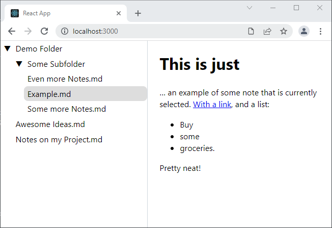

# know-react

*know-react* is a small markdown viewer built with *react*. It looks something like this:



## Usage

*know-react* uses the setup of [create-react-app](https://github.com/facebook/create-react-app). It currently only works in Chromium/Edge because it is using [`window.showDirectoryPicker`](https://developer.mozilla.org/en-US/docs/Web/API/window/showDirectoryPicker). To try the app locally, do

```sh
git clone https://github.com/stultiloquence/know-react know-react
cd know-react
npm install
npm start
```
